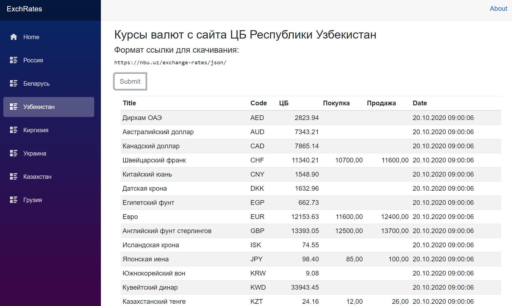

# Обёртка для API получения курсов валют

Захотелось мне поковырять Blazor.  
Поэтому решил я создать простенький сайт на базе ASP.NET Core и Blazor Server.  
Сайт состоит из нескольких страниц - на каждую страну своя страница.  
На каждой странице присутствует кнопка `Submit`.  
Нажимаете её и на странице появляется список курсов валют на указанную дату (или на текущую).  

# Blazor
Для каждой страницы создан отдельный сервис получения данных. В `Startup.cs` сервисы добавлены как `AddScoped<>`. Можно на странице одной страны получить курсы, перейти на другую страницу, потом снова вернуться на первую и полученные ранее данные всё ещё будут отображаться.